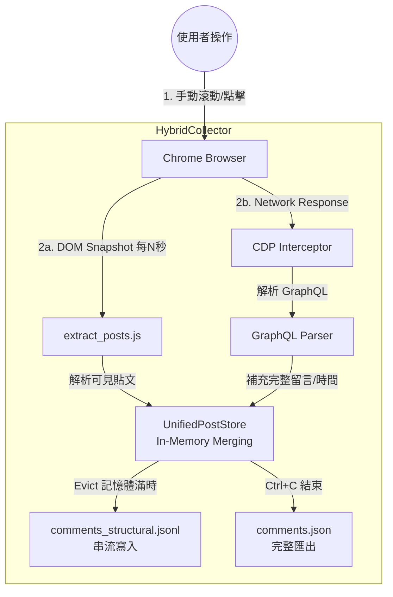

# Ctrl-F Auto Crawler

Facebook 私密社團貼文收集器。

這是一個**混合式（Hybrid）**收集器，同時結合兩種技術來確保資料的完整性：
1. **DOM Snapshot**：週期性讀取頁面上可見的貼文內容（所見即所得）。
2. **GraphQL Interception**：在背景靜默攔截 Facebook 的 API 回應，獲取完整的留言結構（包含被摺疊的留言）。

**核心原則：所有頁面操作（滾動、點擊展開留言、導航）都由你本人手動完成。腳本不會對頁面做任何操作，只被動讀取資料。**

## 系統架構

本系統採用雙軌並行收集策略，統一匯整至 `UnifiedPostStore` 進行去重與合併。



## Prerequisites

- **Python 3.12+**
- **[uv](https://docs.astral.sh/uv/)**（強烈推薦）或 `venv`
- **Google Chrome** 或 Chromium
- 你必須是該 Facebook 私密社團的成員

## Installation

```bash
git clone https://github.com/HsuChen88/ctrl-F-auto-crawler.git
cd ctrl-F-auto-crawler
uv sync
```

## Usage

整個流程需要 **兩個 Terminal 視窗** 同時運作。

### Terminal 1 — 啟動 Chrome (Debug Mode)

```bash
./start_chrome.sh
```
Chrome 會以 remote debugging 模式開啟（port 9222），使用獨立的設定檔，不會影響日常使用。

### Terminal 2 — 啟動收集器

執行整合版收集器：

```bash
uv run unified_collector.py
```

若需自訂參數：
```bash
# 範例：每 5 秒讀一次 DOM，記憶體保留最近 20 篇貼文
uv run unified_collector.py --interval 5.0 --max-posts-in-memory 20
```

### 操作步驟

1. 在 Terminal 1 開啟的 Chrome 中登入 Facebook。
2. 進入目標社團。
3. **開始手動瀏覽**：
   - 往下滾動載入更多貼文。
   - 點擊「查看更多留言」或「查看回覆」來觸發 GraphQL 請求（這會讓收集器抓到隱藏的留言）。
4. Terminal 2 會即時顯示收集進度：
   ```text
     [#15] visible_posts=3 new_posts=1 | intercepts=45 | comments=120 | posts=10
   ```
5. 完成後按 **Ctrl+C**，程式會將剩餘資料寫入檔案並結束。

## 檔案說明

| 檔案 | 作用 |
|------|------|
| **`unified_collector.py`** | **主程式**。整合 DOM 輪詢與 GraphQL 監聽，維護資料一致性。 |
| `common.py` | 共用工具庫（時間正規化、資料結構定義、Protocol）。 |
| `extract_posts.js` | 注入瀏覽器的 JavaScript，負責解析 DOM 結構。 |
| `comment_collector.py` | 負責處理 CDP Network 事件與 GraphQL 解析邏輯。 |
| `collector.py` | 舊版入口（僅含 DOM 邏輯），目前作為 `extract_posts` 的載入器。 |

## 輸入與輸出

### 輸入
- **無須設定檔**：直接讀取瀏覽器當前頁面。
- **手動操作**：你的滾動與點擊就是輸入。

### 輸出

所有輸出檔案位於 `outputs/` 目錄下：

#### 1. `comments_structural.jsonl` (主要產出)
結構化的 JSONL 格式（JSON Lines），適合串流處理與大數據分析。每行代表一次「貼文寫出」事件（Eviction 或 Flush）。

```json
{
  "ts": 1710000000.0,
  "event": "evicted",       // 或 "flush"
  "query": "dom_snapshot",  // 或 GraphQL query name
  "post_id": "12345678",
  "post_text": "貼文內容...",
  "timestamp": "2024年3月15日",
  "comment_count": 50,
  "comments": [
    {
      "comment_id": "987654321",
      "author": "User A",
      "body": "留言內容",
      "time": "2024年3月15日",
      "replies": [          // 巢狀結構
        { "comment_id": "...", "body": "回覆內容..." }
      ]
    }
  ]
}
```

#### 2. `comments.json` (最終彙總)
程式結束時匯出的完整 JSON 陣列。**注意**：若設有 `--max-posts-in-memory`，此檔案僅包含記憶體中最後殘留的貼文，完整的歷史資料請參考 `.jsonl` 檔。

#### 3. `comments_raw.jsonl` (除錯用)
紀錄原始的 GraphQL 回應資料，用於開發與除錯。

## 運作原理細節

1. **DOM Phase (`extract_posts.js`)**:
   - 解決「我看到了什麼」的問題。
   - 獲取貼文文字、連結、按讚數概觀。
   - 解析目前展開的可見留言。

2. **GraphQL Phase (`comment_collector.py`)**:
   - 解決「資料庫裡有什麼」的問題。
   - 當你點擊「查看更多」時，FB 會發送 GraphQL 請求。
   - 腳本攔截回應，獲取精確的 `created_time`、`feedback_id` 以及完整的留言樹狀結構。

3. **Merge Logic (`UnifiedPostStore`)**:
   - 將 DOM 看到的資料與 GraphQL 攔截到的資料即時合併。
   - 自動修正時間格式（將 "剛剛"、"1小時前" 轉換為絕對時間）。
   - 記憶體管理：當貼文數量超過上限（預設 10），自動將舊貼文寫入硬碟並釋放記憶體，確保可長時間執行。
